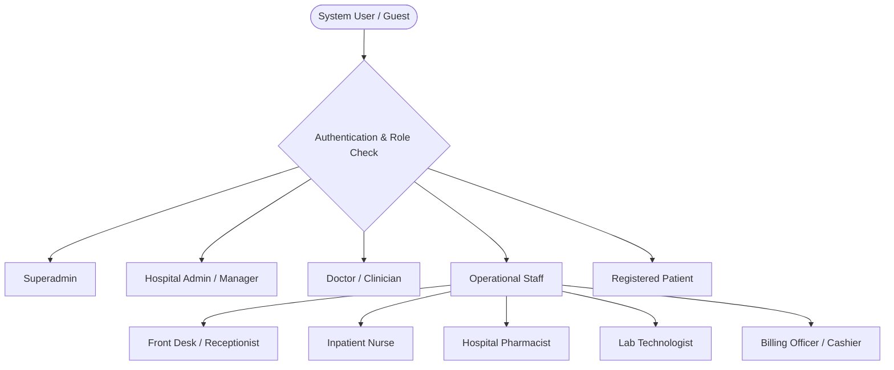
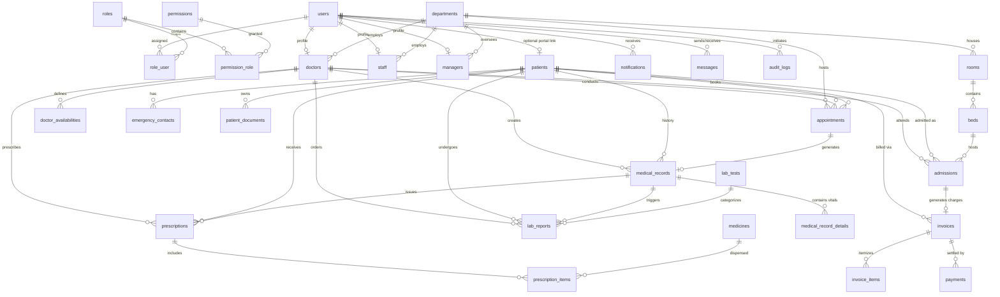

# Hospital Management System (HMS) — Comprehensive Project Features Specification

> **System Overview:**  
> The **Hospital Management System (HMS)** is an enterprise-grade, role-based healthcare operations platform engineered using **PHP 8.2+**, **Laravel 11**, **MySQL/MariaDB** (strictly normalized to 3rd Normal Form - 3NF), and a modern, responsive web presentation layer. It manages the complete hospital lifecycle across clinical care, inpatient/outpatient management (ADT), pharmacy inventory, laboratory diagnostics, financial billing, internal communications, and compliance audit logging.

---

## Table of Contents

1. [Executive Summary & Technology Stack](#1-executive-summary--technology-stack)
2. [User Roles & Access Control Architecture](#2-user-roles--access-control-architecture)
3. [Role-Based Access Control (RBAC) Matrix](#3-role-based-access-control-rbac-matrix)
4. [Comprehensive Feature Catalog by Module](#4-comprehensive-feature-catalog-by-module)
   - [Module 1: Authentication, Authorization & Security](#module-1-authentication-authorization--security)
   - [Module 2: Hospital Organization & Facility Master](#module-2-hospital-organization--facility-master)
   - [Module 3: Patient Management (ADT & Electronic Profile)](#module-3-patient-management-adt--electronic-profile)
   - [Module 4: Doctor Roster & Appointment Scheduling](#module-4-doctor-roster--appointment-scheduling)
   - [Module 5: Clinical EMR / EHR & Consultation Management](#module-5-clinical-emr--ehr--consultation-management)
   - [Module 6: Electronic Prescribing (e-Prescription) & Dispensing](#module-6-electronic-prescribing-e-prescription--dispensing)
   - [Module 7: Laboratory & Diagnostic Management](#module-7-laboratory--diagnostic-management)
   - [Module 8: Hospital Facilities & Real-Time Bed Tracker (Inpatient ADT)](#module-8-hospital-facilities--real-time-bed-tracker-inpatient-adt)
   - [Module 9: Pharmacy & Medicine Inventory Control](#module-9-pharmacy--medicine-inventory-control)
   - [Module 10: Billing, Invoicing & Multi-Channel Payments](#module-10-billing-invoicing--multi-channel-payments)
   - [Module 11: Internal Communication & Notifications](#module-11-internal-communication--notifications)
   - [Module 12: Public Healthcare Portal & Doctor Directory](#module-12-public-healthcare-portal--doctor-directory)
   - [Module 13: System Administration, Audit Trails & Analytics](#module-13-system-administration-audit-trails--analytics)
5. [Role-Tailored Dashboards](#5-role-tailored-dashboards)
6. [Database Schema & Entity-Relationship Model](#6-database-schema--entity-relationship-model)
7. [System Route & Endpoint Map](#7-system-route--endpoint-map)
8. [Quick-Start Demo Credentials](#8-quick-start-demo-credentials)

---

## 1. Executive Summary & Technology Stack

The platform is architected to eliminate administrative bottlenecks, reduce medical errors, enforce strict financial accountability, and provide seamless access to electronic healthcare records for medical staff and patients alike.

### Core Technology Stack
| Layer | Technology / Implementation |
| :--- | :--- |
| **Backend Framework** | Laravel 11.x (PHP 8.2+) with strict MVC architecture |
| **Database Engine** | MySQL 8.0+ / MariaDB 10.4+ adhering strictly to **3rd Normal Form (3NF)** |
| **Security & Auth** | BCrypt password hashing, session regeneration, granular RBAC middleware (`role:*`), CSRF protection |
| **Frontend UI** | Blade Templating Engine, Responsive CSS3, FontAwesome iconography, Chart / Status Matrix UI components |
| **Audit & Governance** | Automated Event Logging (`AuditService`) capturing IP addresses, actors, timestamps, and model mutations |

---

## 2. User Roles & Access Control Architecture

The platform partitions capabilities across **6 primary roles** and specialized operational sub-roles:



### Role Descriptions
1. **Superadmin**: Full system authority. Manages system configurations, global settings, user accounts, role definitions, audit logs, and institutional reporting.
2. **Admin (Hospital Manager / COO)**: Departmental supervisor managing resource allocation, facility infrastructure, physician scheduling, and operational throughput.
3. **Doctor / Clinician**: Licensed healthcare practitioner who conducts clinical consultations, logs SOAP notes, records vital sign observations, issues digital prescriptions, orders laboratory tests, and admits/discharges inpatients.
4. **Staff (Clinical & Administrative Support)**:
   - **Receptionist / Front Desk**: Manages patient registration, walk-in inquiries, appointment check-ins, and queue triage.
   - **Inpatient Nurse**: Monitors ward beds, records vitals during inpatient stays, and facilitates bed turnover.
   - **Pharmacist**: Controls drug inventory, monitors reorder thresholds, and dispenses medicines against active e-prescriptions.
   - **Laboratory Technologist**: Processes diagnostic orders, enters specimen findings, and uploads laboratory reports.
   - **Billing Officer / Cashier**: Generates itemized consolidated invoices, collects multi-channel payments, and prints formal financial receipts.
5. **Patient**: Accesses personal health records (PHR), reviews physician consultation history, checks prescription regimens, views lab test reports, books appointments, and reviews/pays invoices online.
6. **Guest User (Public Visitor)**: Prospective patient browsing public hospital directories, doctor profiles, and submitting online appointment booking requests prior to identity verification.

---

## 3. Role-Based Access Control (RBAC) Matrix

> **Legend:**  
> - **C**: Create  
> - **R**: Read / View  
> - **U**: Update / Edit  
> - **D**: Delete  
> - **-**: No Access  
> - **(Own)**: Restricted strictly to records belonging to the authenticated user

| Functional Domain / Module | Superadmin | Doctor | Staff | Patient | User / Guest |
| :--- | :---: | :---: | :---: | :---: | :---: |
| **System Settings & Config** | `CRUD` | `-` | `-` | `-` | `-` |
| **User & Role Management** | `CRUD` | `-` | `-` | `-` | `-` |
| **Audit Logs & Security Trails** | `R` | `-` | `-` | `-` | `-` |
| **Department & Facility Setup** | `CRUD` | `R` | `R` | `R` | `R` |
| **Doctor Availability & Roster** | `CRUD` | `CRU` | `R` | `R` | `R` |
| **Patient Registration & Demographics** | `CRUD` | `R` | `CRU` | `U (Own)` | `-` |
| **Appointment Booking & Status** | `CRUD` | `CRU` | `CRU` | `CRU (Own)` | `C (Request)` |
| **EHR & Medical Consultation Records**| `CRUD` | `CRUD`| `RU` | `R (Own)` | `-` |
| **Prescriptions & e-Prescribing** | `CRUD` | `CRUD`| `R (Fulfill)`| `R (Own)` | `-` |
| **Laboratory Tests & Reports** | `CRUD` | `CRU` | `CRU (Tech)`| `R (Own)` | `-` |
| **Bed Allocation & Ward Admissions** | `CRUD` | `R` | `CRU` | `R (Own)` | `-` |
| **Billing, Invoicing & Payments** | `CRUD` | `R` | `CRU` | `R (Own)` | `-` |
| **Pharmacy & Medicine Stock** | `CRUD` | `R` | `CRU (Pharm)`| `-` | `-` |
| **Internal Messages & Notifications** | `CRUD` | `CRU` | `CRU` | `CRU (Own)`| `R` |

---

## 4. Comprehensive Feature Catalog by Module

### Module 1: Authentication, Authorization & Security
- **Unified Authentication Engine**: Secure login supporting both email and username identifiers with automatic session fixation protection.
- **Role-Based Routing Middleware**: Automatic redirection to dedicated dashboards based on verified role (`superadmin`, `doctor`, `staff`, `patient`).
- **One-Click Quick Demo Login**: Fast-switch evaluation bar supporting instant authentication across 9 distinct roles and personas without manual credential typing.
- **Account Status Enforcement**: Active account verification preventing inactive or suspended users from gaining access (`active`, `inactive`, `suspended`).
- **Self-Service Profile Management**: Password changing, personal information updating, and avatar display.
- **Granular RBAC Architecture**: Many-to-many relationships across `users`, `roles`, `permissions`, `role_user`, and `permission_role`.

### Module 2: Hospital Organization & Facility Master
- **Department Directory**: Full CRUD management of specialized clinical and administrative wings (Cardiology, Neurology, Pediatrics, Orthopedics, Emergency, Radiology, etc.).
- **Department Codes & Taxonomy**: Systematic short codes (e.g. `CARD`, `NEUR`, `EMER`) for record indexing and routing.
- **Doctor Profiles & Credentialing**: Detailed clinical profiles with medical license numbers (`MED-CARD-XXXXX`), consultation fees, contact numbers, and professional biographies.
- **Staff Personnel Management**: Tracking employee job titles, assigned operational department, hire dates, and direct contact numbers.
- **Hospital Management Hierarchy**: Specialized `managers` entity tracking departmental chiefs, department heads, and Chief Operating Officers (COO).

### Module 3: Patient Management (ADT & Electronic Profile)
- **Comprehensive Patient Onboarding**: Intake form capturing full demographic details (name, date of birth, biological sex, blood group, contact phone, residential address).
- **Unique Patient Identifier (UPI)**: Automated UPI code generator format `PAT-YYYY-XXXX` ensuring zero record collision.
- **Blood Group Indexing**: System tracking standard blood typings: `A+`, `A-`, `B+`, `B-`, `AB+`, `AB-`, `O+`, `O-`.
- **Emergency Contact Directory**: Dedicated child relation storing primary and secondary next-of-kin contacts, relationships (Spouse, Parent, Guardian), and emergency telephone numbers.
- **Patient Document Vault**: Secure upload, storage, and retrieval of electronic insurance policies, government identification cards, external medical scans, and legal consent forms (`patient_documents`).
- **Portal Account Linking**: Ability to link unverified web portal user accounts (`users`) to offline clinical patient profiles (`patients`).
- **360° Unified Patient Chart**: Single-pane medical view aggregating active inpatient stays, past consultations, vitals charts, prescriptions, diagnostic results, and financial invoices.

### Module 4: Doctor Roster & Appointment Scheduling
- **Doctor Shift & Availability Roster**: Per-doctor weekly schedule builder (`doctor_availabilities`) configuring working days (Monday–Sunday), shift start/end hours, and active/inactive status.
- **Intelligent Appointment Booking**: Interactive appointment wizard featuring:
  - Department filtering
  - Specialist selection
  - Dynamic consultation fee computation
  - Real-time time slot picking
  - Reason for visit documentation
- **Encounter Lifecycle Tracking**: Complete status workflow state machine:
  $$\text{Scheduled} \longrightarrow \text{Completed} \quad \Big| \quad \text{Cancelled} \quad \Big| \quad \text{No Show}$$
- **Queue Triage & Waiting Room Display**: Receptionist and front-desk real-time queue view showing patients scheduled for today, ordered chronologically.
- **Online Booking Requests**: Public booking widget allowing prospective patients to schedule appointments with automated staff triage.

### Module 5: Clinical EMR / EHR & Consultation Management
- **Digital Consultation Encounter Notes**: Structured clinical documentation including primary diagnosis, clinical symptoms, and doctor's progress notes.
- **Atomic Vital Signs Recording**: Dedicated clinical observation tracking (`medical_record_details`) capturing:
  - Systolic & Diastolic Blood Pressure (mmHg)
  - Heart Rate / Pulse (bpm)
  - Respiratory Rate (breaths/min)
  - Body Temperature (°C / °F)
  - Oxygen Saturation ($SpO_2$ %)
  - Body Weight (kg), Height (cm), and calculated BMI
- **Consultation-Appointment Binding**: Seamless bidirectional linkage between the appointment booking, the attending physician, the patient, and the clinical record.
- **Printable Medical Summaries**: Formatted clinical consultation printout with hospital header, doctor license info, vitals breakdown, and clinical impressions.

### Module 6: Electronic Prescribing (e-Prescription) & Dispensing
- **Digital Prescription Authoring**: Clinician authoring interface linked directly to medical records and patient charts.
- **Multi-Item Medication Builder**: Add multiple medications per encounter with granular dosage parameters:
  - Medication name & generic classification
  - Strength / Dosage (e.g. *500mg*, *10ml*)
  - Intake frequency (e.g. *Once daily*, *Twice daily after meals*, *Every 8 hours*)
  - Duration in days
  - Specific intake instructions (e.g. *Take with food*, *Avoid alcohol*)
- **Dispensing Integration**: Real-time integration into the pharmacy dispensing queue.
- **Automated Stock Deduction**: Dispensing medications validates current stock and automatically decrements inventory counts.
- **Printable Prescription Slips**: Standardized medical Rx slips suitable for physical pharmacy fulfillment or patient records.

### Module 7: Laboratory & Diagnostic Management
- **Test Catalog & Tariff Master**: Master catalog of lab and radiology procedures (`lab_tests`) specifying unique test codes, test descriptions, and service fees.
- **Clinical Diagnostic Order Entry**: Doctors place diagnostic test requests directly from the patient encounter screen.
- **Specimen & Processing Lifecycle**:
  $$\text{Requested} \longrightarrow \text{In Progress} \longrightarrow \text{Completed} \quad \Big| \quad \text{Cancelled}$$
- **Diagnostic Result Recording**: Lab technicians log detailed qualitative and quantitative findings into the record.
- **Digital Report Attachment**: Upload capability for external scanned lab documentation, digital imaging scans (X-Ray, MRI, CT, Ultrasound), or pathology PDF summaries.
- **Instant Patient / Physician Access**: Immediate publication of verified lab reports to both doctor and patient dashboards.

### Module 8: Hospital Facilities & Real-Time Bed Tracker (Inpatient ADT)
- **Room & Ward Classification**: Support for diverse accommodation categories:
  - Intensive Care Units (ICU)
  - Private Rooms
  - Semi-Private Wards
  - General Wards
  - Operating Theaters
- **Ward Daily Rate Architecture**: Per-room daily tariff configuration automatically applied during inpatient billing calculations.
- **Interactive Visual Bed Tracker**: Real-time bed matrix visually distinguishing:
  - 🟢 **Available** (Ready for admission)
  - 🔴 **Occupied** (Currently holding patient)
  - 🟡 **Cleaning** (Under terminal disinfection)
  - ⚪ **Maintenance** (Out of service)
- **Inpatient Admission Workflow**:
  - Direct patient bed assignment
  - Attending physician assignment
  - Admission timestamp recording
  - Instant transition of bed state to `occupied`
- **Discharge & Bed Turnover**: Discharge processing recording departure timestamps, freeing up hospital beds for sanitation and triggering inpatient billing summaries.

### Module 9: Pharmacy & Medicine Inventory Control
- **Drug Master Database**: Directory of pharmaceuticals with trade names, generic chemical names, categories (Antibiotics, Analgesics, Antihypertensives, Antidiabetics, etc.), and unit prices.
- **Real-Time Stock Inventory**: Stock quantity monitoring with automatic decrementing upon pharmacy dispensing.
- **Reorder Level Alerts**: Visual dashboard alerts highlighting medications falling below critical safety thresholds.
- **Stock Adjustment & Restocking**: Dedicated inventory adjustment tools for batch deliveries, physical inventory audits, and loss write-offs.
- **Dedicated Pharmacist Dispensing Queue**: Streamlined interface displaying all pending unfulfilled prescriptions with one-click verification and fulfillment.

### Module 10: Billing, Invoicing & Multi-Channel Payments
- **Consolidated Itemized Invoicing**: Automated creation of combined invoices aggregating:
  - Physician consultation fees
  - Inpatient room & bed charges ($Rate \times Days$)
  - Diagnostic laboratory and radiology test fees
  - Dispensed pharmacy medications
  - Miscellaneous nursing and procedure fees
- **Dynamic Financial Calculation**:
  $$\text{Net Amount} = (\text{Total Items Subtotal} - \text{Discount Amount}) + \text{Tax Amount}$$
- **Multi-Channel Payment Processing**: Support for cash, credit card, debit card, health insurance claims, UPI, and bank wire transfers.
- **Invoice Lifecycle & Partial Settlement**:
  $$\text{Unpaid} \longrightarrow \text{Partially Paid} \longrightarrow \text{Paid} \quad \Big| \quad \text{Cancelled}$$
- **Formal Invoices & Receipts**: Exportable and printable invoices with tax breakdowns, patient UPI, hospital tax details, and payment histories.

### Module 11: Internal Communication & Notifications
- **Categorized In-App Notifications**: Real-time alerts categorized into:
  - `appointment`: Reminders, schedule modifications, cancellations
  - `billing`: Invoice issuance, receipt confirmations
  - `lab_result`: Ready diagnostic reports
  - `system`: Administrative announcements, security alerts
- **Notification Inbox**: Read/unread toggles and one-click "Mark All As Read" functionality.
- **Peer-to-Peer Staff Messaging**: Internal messaging channel between doctors, nurses, administration, and support staff.

### Module 12: Public Healthcare Portal & Doctor Directory
- **Public Hospital Homepage**: Modern responsive landing page showcasing hospital departments, key statistics, emergency contact numbers, and clinical services.
- **Doctor Directory & Specialty Search**: Public searchable catalog of physicians filterable by clinical department and physician name.
- **Departmental Showcase**: Detailed department pages showcasing medical staff, facilities, and available inpatient accommodations.
- **Online Booking Inquiry Form**: Interactive appointment booking form for prospective patients with automated routing to the reception triage queue.

### Module 13: System Administration, Audit Trails & Analytics
- **System User Management**: Full administrative dashboard to create users, assign roles, reset credentials, and toggle account statuses.
- **Departmental Configuration**: Create, edit, and reorganize hospital clinical branches.
- **Security Audit Trail**: Immutable logging system recording every critical action:
  - Event Type: `LOGIN`, `CREATE`, `UPDATE`, `DELETE`, `DISPENSE`, `ADMIT`, `DISCHARGE`, `PAYMENT`
  - Target table and primary record ID
  - User ID and actor details
  - Client IP address and UTC timestamp
- **Dynamic System Settings**: Key-value runtime settings for hospital name, contact email, emergency hotline, currency symbols, and default tax rates.

---

## 5. Role-Tailored Dashboards

The system features four purpose-built analytical dashboards:

```
┌─────────────────────────────────────────────────────────────────────────────┐
│                            SUPERADMIN DASHBOARD                             │
├─────────────────┬─────────────────┬─────────────────┬───────────────────────┤
│ Total Patients  │ Active Doctors  │ Total Staff     │ Bed Occupancy Rate %  │
│ Today's Appts   │ Total Revenue   │ Unpaid Invoices │ Low Stock Drug Alerts │
├─────────────────┴─────────────────┴─────────────────┴───────────────────────┤
│ Recent Appointments  │  Active Inpatient Admissions  │  System Audit Log Feed │
└─────────────────────────────────────────────────────────────────────────────┘
```

```
┌─────────────────────────────────────────────────────────────────────────────┐
│                              DOCTOR DASHBOARD                               │
├─────────────────┬─────────────────┬─────────────────┬───────────────────────┤
│ Today's Queue   │ Completed Today │ Total Patients  │ Active Prescriptions  │
├─────────────────┴─────────────────┴─────────────────┴───────────────────────┤
│ Today's Appointments Timeline  │ Pending Lab Reports  │ Recent Medical Records │
└─────────────────────────────────────────────────────────────────────────────┘
```

```
┌─────────────────────────────────────────────────────────────────────────────┐
│                          STAFF / OPERATIONS DASHBOARD                        │
├─────────────────┬─────────────────┬─────────────────┬───────────────────────┤
│ Today's Checkins│ Available Beds  │ Occupied Beds   │ Pending Prescriptions │
├─────────────────┴─────────────────┴─────────────────┴───────────────────────┤
│ Waiting Room Queue  │ Pharmacy Dispense Queue │ Unpaid Invoices │ Lab Orders│
└─────────────────────────────────────────────────────────────────────────────┘
```

```
┌─────────────────────────────────────────────────────────────────────────────┐
│                            PATIENT HEALTH PORTAL                            │
├─────────────────┬─────────────────┬─────────────────┬───────────────────────┤
│ My Appointments │ Active Rx Regimens│ Diagnostic Tests│ Pending Invoices     │
├─────────────────┴─────────────────┴─────────────────┴───────────────────────┤
│ Upcoming Visits │ Medical Consultation History │ Lab Reports │ Invoices & Pay│
└─────────────────────────────────────────────────────────────────────────────┘
```

---

## 6. Database Schema & Entity-Relationship Model

The database adheres strictly to **Third Normal Form (3NF)** across **29 interconnected tables**:



---

## 7. System Route & Endpoint Map

### Public Endpoints
- `GET /` : Hospital Homepage & Services Overview
- `GET /doctors-directory` : Searchable Doctor Directory
- `GET /departments-overview` : Department Directory & Facilities
- `POST /book-appointment-request` : Online Booking Request Submission

### Authentication & Session Endpoints
- `GET /login` : Login Screen (includes 1-Click Quick Demo Bar)
- `POST /login` : Process User Authentication
- `GET /login/demo/{role}` : Instant Demo Login Switcher
- `GET /register` : Patient Self-Registration
- `POST /register` : Process Registration
- `POST /logout` : Secure Session Logout

### Core Authenticated Modules
- `GET /profile` & `POST /profile` : User Profile & Password Updates
- `GET /dashboard` : Role-Directed Central Dashboard
- `/patients/*` : Patient Registration, Search, Charting, Document Upload
- `/appointments/*` : Booking Wizard, Scheduling, Status Lifecycle
- `/doctor/schedule` : Physician Weekly Shifts & Availability Roster
- `/medical-records/*` : Clinical Consultations, Vitals Logging, Printable Summaries
- `/prescriptions/*` : e-Prescription Authoring, Item Builder, Dispensing, Rx Printing
- `/lab/*` : Test Master, Diagnostic Requests, Result Logging, PDF Report Viewer
- `/facilities/*` : Interactive Bed Tracker, Ward Management, Inpatient Admissions & Discharges
- `/pharmacy/*` : Medicine Master, Batch Adjustments, Low-Stock Warnings, Dispensing Queue
- `/billing/*` : Invoicing, Itemized Calculations, Multi-Channel Payment Processing, Print Receipts
- `/notifications/*` & `/messages/*` : Alerts, Message Inbox, Peer-to-Peer Communication

### Administrative Endpoints (`/admin/*`)
- `GET /admin/users` : System User Directory & Role Assignment
- `POST /admin/users/{id}/toggle-status` : Instant Account Suspension / Activation
- `GET /admin/departments` : Department Management & Code Master
- `GET /admin/audit-logs` : Security Audit Trail & Event Monitoring
- `GET /admin/settings` : Hospital System Global Configurations

---

## 8. Quick-Start Demo Credentials

All test accounts share the standard password: **`password`**  
You can also use the **One-Click Quick Demo** bar located at the top of `/login` or directly visit `/login/demo/{role}`.

| Persona / Role | Email | Username | Key Responsibilities |
| :--- | :--- | :--- | :--- |
| **Superadmin** | `superadmin@hospital.test` | `superadmin` | System config, user management, audit logs, hospital KPIs |
| **Admin (COO)** | `admin@hospital.test` | `admin` | Operations management, departmental oversight, facility rules |
| **Doctor (Cardiology)** | `dr.sarah@hospital.test` | `dr_sarah` | Consultations, vitals, prescriptions, diagnostic orders |
| **Doctor (Neurology)** | `dr.james@hospital.test` | `dr_james` | Clinical care, specialty consultations, inpatient admissions |
| **Receptionist** | `receptionist@hospital.test` | `receptionist` | Walk-in registration, appointment booking, queue management |
| **Head Nurse** | `nurse@hospital.test` | `nurse` | Inpatient monitoring, ward management, bed status turnover |
| **Lead Pharmacist** | `pharmacist@hospital.test` | `pharmacist` | Stock control, drug catalog, prescription fulfillment |
| **Lab Technologist** | `labtech@hospital.test` | `labtech` | Lab test fulfillment, diagnostic findings, report uploads |
| **Billing Cashier** | `cashier@hospital.test` | `cashier` | Invoices, itemized charges, payment collection, receipts |
| **Patient** | `patient.john@hospital.test` | `patient_john` | Personal health records, view lab reports, book visits |
